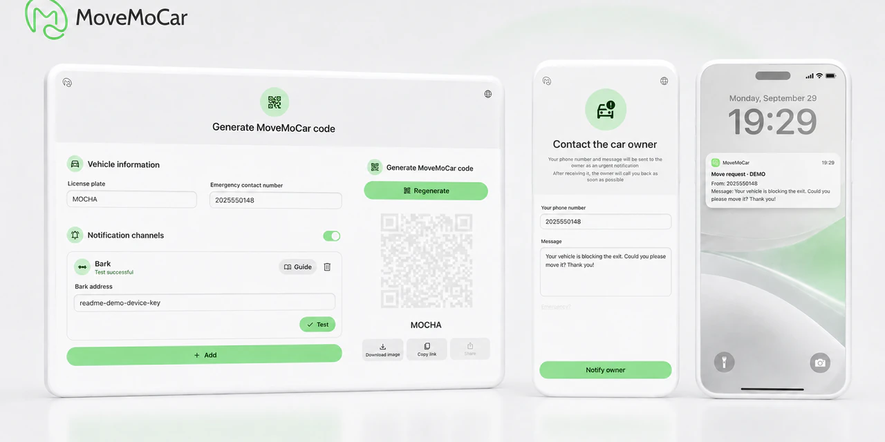
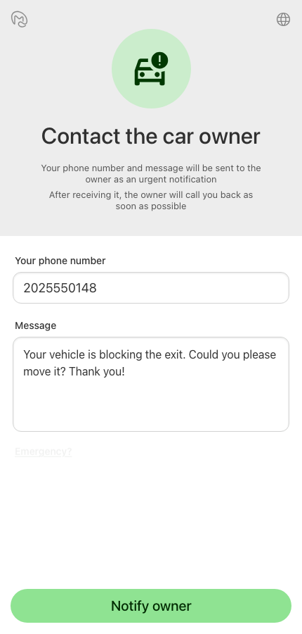
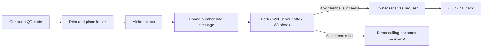
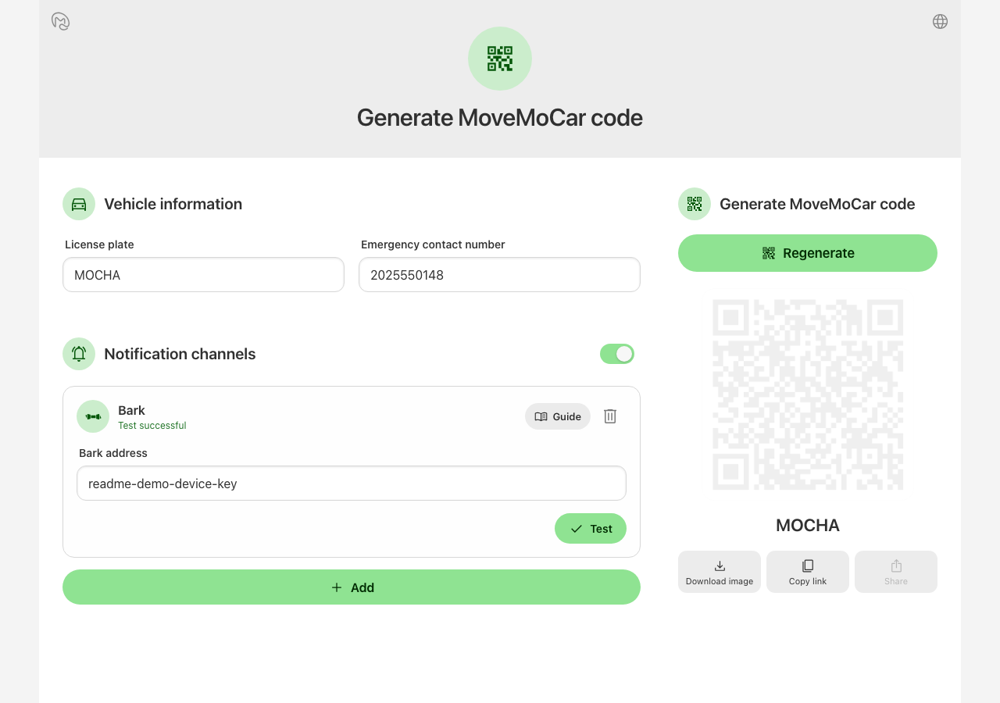
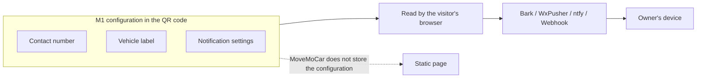

<p align="center">
  
</p>

# MoveMoCar ☕️

<p align="center">
  <a href="https://github.com/5nix/MoveMoCar/actions/workflows/ci.yml"></a>
  <a href="./LICENSE"></a>
  <a href="#github-pages"></a>
</p>

---

<p align="center">
  <strong>A simple, elegant, backend-free open-source parking contact QR code</strong><br>
  Scan, leave a message, notify the owner, and call only when needed<br>
  🌐 <a href="./README.md">简体中文</a> · 🖥️ <a href="https://mmc.ironip.ink/">Open website</a> · 💠 <a href="https://mmc.ironip.ink/create/">Create my MoveMoCar code</a> · 👀 <a href="https://mmc.ironip.ink/m/demo/">Try the visitor view</a>
</p>

---


MoveMoCar sounds like **Move Mocha ☕️**. I hope this simple, elegant little project feels every bit as smooth as a mocha.



---

## Why MoveMoCar exists

After the phone number card behind my windshield attracted its fifth advertising message, I decided something had to change.

I started looking for a way to stop leaving my phone number exposed in public all the time.

There were already several answers: virtual numbers, message relays, notification services, and more. They can all solve the problem. But keeping an online service running costs money, so many parking-contact products eventually make the person scanning the code watch ads, register, sign in, follow an account, or pay before moving on.

Parking contact should not be that complicated.

Someone who genuinely needs the car moved should be able to reach you easily. Someone who is merely passing by, collecting numbers, or sending bulk advertising may lose interest after one extra step.

MoveMoCar grew out of that idea.

For you and me, it is simply a small upgrade to the plain-text phone number card behind the windshield.

Put the generated QR code in your car. When someone scans it, they see a clean contact page and leave their own phone number and a message.

MoveMoCar sends that information through the notification channels you configured, such as Bark, WxPusher, or ntfy. Once notified, you can call them back directly.

After a notification succeeds, a discreet “Emergency?” entry appears below the form.

Anyone facing a real emergency should be able to find it. :)

<p align="center">
  
</p>

## A small barrier

MoveMoCar does not try to turn your phone number into an unbreakable secret.

The number is still encoded in the QR code, and someone determined to inspect its contents can still find it.

What MoveMoCar does is simple: your number is no longer printed openly on the windshield or shown immediately after someone scans the code.

For an ordinary parking request, the only extra step is entering a phone number and a short message.

For someone casually collecting phone numbers, that may already be enough friction.

## How it works

The entire process is short:

**①** Open the generator and enter your contact and notification settings<br>
**②** Generate the QR code, print it, and place it in the car<br>
**③** Someone scans it and leaves their phone number and message<br>
**④** MoveMoCar sends the request through your notification channels<br>
**⑤** You receive the notification and call them back



## ✨ Features

- ☕️ **A clean scan experience**<br>
  A focused mobile contact page with no ads, login, or unnecessary steps.

- 🔔 **Message first, contact second**<br>
  The visitor leaves their phone number and message, then the owner calls back after receiving the notification.

- ☎️ **Emergency calling remains available**<br>
  A discreet direct-call entry appears after a successful notification; if every channel fails, the page clearly offers direct calling.

- 📡 **Multiple notification channels**<br>
  Configure several notification methods and send to them concurrently.

- 🧰 **Built-in QR code generator**<br>
  Enter the settings, test the notification channels, generate the QR code, and print it.

- 🪶 **Static frontend**<br>
  No user database and no MoveMoCar application backend to maintain.

- 🏠 **Use the public instance or self-host**<br>
  A public instance is available at `mmc.ironip.ink`, and the entire project can also run on your own domain.

- 🌍 **Multilingual**<br>
  Currently supports Simplified Chinese, Traditional Chinese, English, Japanese, Korean, Spanish, French, German, Italian, and Brazilian Portuguese.

---

## 🚀 Create your QR code

If you only want to create your own MoveMoCar code, open:

**[https://mmc.ironip.ink/create/?lang=en](https://mmc.ironip.ink/create/?lang=en)**

Enter your settings and generate the QR code.



After generating it, scan the code once with your phone before printing.

## 🔔 Notification channels

MoveMoCar currently supports:

| Channel | Best suited for | Quick callback | Setup |
| --- | --- | --- | --- |
| Bark | iOS and iPadOS users | ✅ | Paste a Bark server URL or device key |
| WxPusher | Android and HarmonyOS users in mainland China | ✅ | Paste the SPT copied from the app |
| ntfy | Android users and anyone who prefers self-hosted or cross-platform notifications | ✅ | Subscribe to the topic generated by MoveMoCar; self-hosted servers are also supported |
| Webhook | Advanced custom setups | Depends on configuration | Connect another service with a custom HTTPS request template |

You can configure up to five notification channels. MoveMoCar attempts all configured channels concurrently.

---

## 🪶 Frontend only

MoveMoCar runs entirely as static pages.

There are no accounts, no user database, and no MoveMoCar backend that stores vehicles, phone numbers, or messages.

When a QR code is generated, the contact number, vehicle label, and notification settings are encoded using MoveMoCar's open data format. After a scan, the browser reads that configuration and sends the notification directly from the visitor's device.

A QR code is meant to be printed and placed in the physical world, so I want it to depend on as little long-running central infrastructure as possible.

Many centralized parking-contact codes rely on a service provider's database. They work while the service remains online, but if the project shuts down, already-printed codes may stop working as well.

MoveMoCar keeps the configuration inside the QR code itself and uses an open data format.

Even if the official instance were no longer running someday, the configuration would still be present in the code. Any page or reader compatible with the MoveMoCar format could continue reading it; others could also deploy a compatible instance or build their own reader.

At the very least, MoveMoCar does not leave your configuration in someone else's database.

The complete encoding and compatibility rules are documented in [MoveMoCar M1 Format](./docs/qr-format-v1.md). The official domain can continue pointing to a new static instance, and any M1-compatible page can read the configuration. The configuration lives in the URL Fragment and is not sent to the static host in an ordinary HTTP request.



## 🏠 Self-hosting

> **To display custom text in the page footer, set the string variable `VITE_FOOTER_TEXT` at build time. The string will appear at the bottom of every page.**

### One-click deployment

<p align="center">
  <a href="https://vercel.com/new/clone?repository-url=https://github.com/5nix/MoveMoCar"></a>
  <a href="https://app.netlify.com/start/deploy?repository=https://github.com/5nix/MoveMoCar"></a>
  <a href="https://deploy.workers.cloudflare.com/?url=https://github.com/5nix/MoveMoCar"></a>
</p>

### Manual deployment

#### Cloudflare Pages

When importing the repository from GitHub, use:

- Framework preset: `React (Vite)`
- Build command: `npm run build`
- Build output directory: `dist`
- Root directory: leave blank

[Open the Cloudflare Pages Git integration guide](https://developers.cloudflare.com/pages/get-started/git-integration/)

#### GitHub Pages

The repository includes a deployment workflow. After forking it, open **Settings → Pages**, set **Source** to **GitHub Actions**, then manually run **Actions → Deploy to GitHub Pages**.

#### Web Server

With Node.js 22.12 or newer:

```bash
npm install
npm run build
```

Publish the generated `dist` directory as a static website. MoveMoCar uses a relative Base Path, so it can run at the root or under a subpath.

## 🧩 M1 QR code format

MoveMoCar encodes the contact number, vehicle label, and notification-channel settings in the QR code.

The format is open. For the wire format, compatibility rules, or information needed to build another reader, see [MoveMoCar M1 Format](./docs/qr-format-v1.md).

---

## ❓ Q&A

#### Q1. Can I use MoveMoCar without configuring Bark, WxPusher, or ntfy?

Yes. You can generate a QR code containing only a contact number, although the experience will be closer to a conventional parking contact code.

When possible, configuring at least one notification channel is recommended. It lets the visitor leave a message first, so your number is not the first contact method presented.

#### Q2. Does the “License plate” field have to contain a real license plate?

No.

It is simply a vehicle label used in notifications. You can enter a real plate, a vehicle nickname, or anything else that helps you identify the right car.

#### Q3. What should I do after changing my phone number or notification settings?

Generate and print a new QR code.

The configuration travels with the QR code, so an already-printed code does not update automatically.

#### Q4. Does the official instance store my phone number?

No. The contact number, vehicle label, and notification settings live in the URL Fragment and are not sent to the MoveMoCar static host in an ordinary HTTP request. The visitor's submission is sent directly from their browser to the notification service you configured.

#### Q5. Can someone extract my phone number from the QR code?

Yes.

Someone who deliberately analyzes the QR code can still read its contents. MoveMoCar is intended to reduce direct exposure in everyday situations.

#### Q6. If a notification service is unavailable, can someone still contact me?

The page will not leave the visitor stuck at the notification step.

MoveMoCar attempts all configured channels. If every channel fails, the page explains that the notification failed and makes direct calling available.

---

## 🧑‍💻 Development

Node.js 22.12 or newer is required.

```bash
npm install
npm run dev
```

Build and test:

```bash
npm run build
npm test
```

## 🤝 Contributing

Issues and pull requests are welcome.

Please let me know if you find any of the following:

- a browser where the contact page does not work correctly
- a notification channel that fails
- a translation that could sound more natural
- another notification method that would suit MoveMoCar
- anything that could be made simpler

This project began with a small everyday annoyance. Every suggestion can help make it better.

## 📄 License

MoveMoCar is licensed under the [GNU Affero General Public License v3.0](./LICENSE).

---

This is my first project. If MoveMoCar solves a problem for you, please give it a ⭐ — it would mean a lot!
