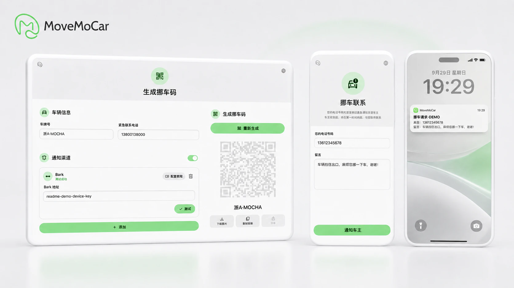
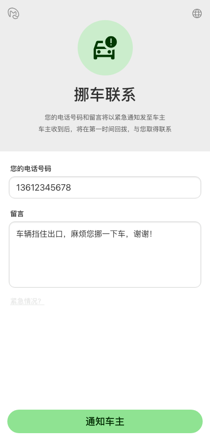
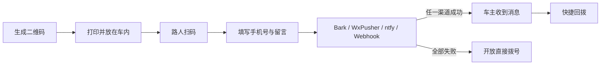
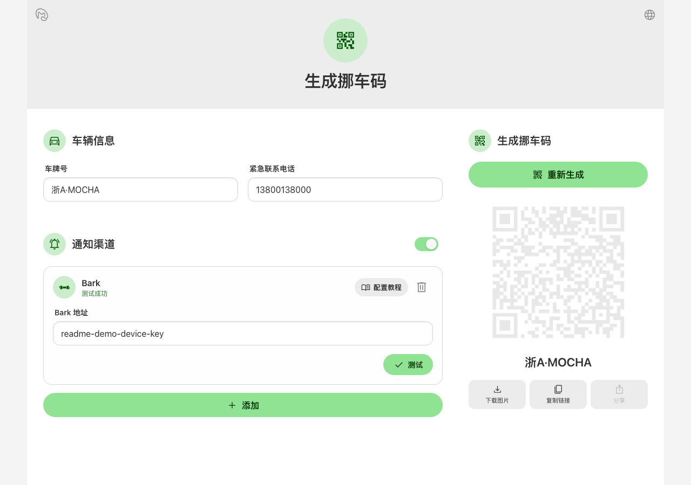
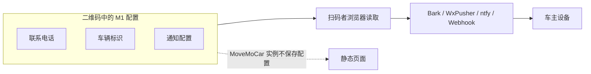

<p align="center">
  
</p>

# MoveMoCar ☕️

<p align="center">
  <a href="https://github.com/5nix/MoveMoCar/actions/workflows/ci.yml"></a>
  <a href="./LICENSE"></a>
  <a href="#github-pages"></a>
</p>

<p align="center">
  <a href="https://vercel.com/new/clone?repository-url=https://github.com/5nix/MoveMoCar"></a>
  <a href="https://app.netlify.com/start/deploy?repository=https://github.com/5nix/MoveMoCar"></a>
  <a href="https://deploy.workers.cloudflare.com/?url=https://github.com/5nix/MoveMoCar"></a>
</p>

---

<p align="center">
  <strong>A simple, elegant, backend-free open-source parking contact QR code</strong><br>
  Scan, leave a message, notify the owner, and call only when needed<br>
  🌐 <a href="./README.en.md">Open English README</a> · 🖥️ <a href="https://mmc.ironip.ink/?lang=en">Open website</a> · 💠 <a href="https://mmc.ironip.ink/create/">Create my MoveMoCar code</a> · 👀 <a href="https://mmc.ironip.ink/m/demo/?lang=en">Try the visitor view</a>
</p>

---

<p align="center">
  <strong>一个简洁、优雅、无需后端的开源挪车码</strong><br>
  扫码、留言、通知车主，需要的时候再打电话<br>
  🌐 <a href="./README.en.md">English</a> · 🖥️ <a href="https://mmc.ironip.ink/">打开官网</a> · 💠 <a href="https://mmc.ironip.ink/create/">生成我的挪车码</a> · 👀 <a href="https://mmc.ironip.ink/m/demo/">体验扫码者视角</a>
</p>

---

MoveMoCar 谐音自 **Move Mocha ☕️**。希望这个简洁优雅的小项目，也能给你带来一点摩卡般的丝滑体验



---

## 为什么会有 MoveMoCar

当我放在车窗后面的号码第五次收到广告短信时，我觉得这不能继续下去了。

于是我开始找，有没有什么办法，可以让手机号不用一直在公共场所裸奔。

我找到了一些方案。虚拟号码（VoIP）、短信中转、消息通知……都能解决问题。不过运营在线服务总会有成本，所以很多挪车服务最终都会让扫码的人先看一两个广告，或者注册、登录、关注什么东西再走。

但挪车这件事本来没有那么复杂。

真正需要联系车主的人，应该可以很顺利地找到你；至于那些只是路过、扫号、抄号、群发广告的人，多一道步骤，也许就足够让其中一部分人失去兴趣。

MoveMoCar 就是这次探索的产物。

对你我来说，它只是车窗后那个明文号码牌的一次小小升级。

把生成好的二维码放在车里。别人扫码以后，会先看到一个很简单的联系页面，填写自己的手机号和留言。

这些信息会被发送到你配置好的通知渠道，比如 Bark、WxPusher 或 ntfy。你收到通知后，可以直接回拨。

通知发送成功以后，页面下面会悄悄出现一个「紧急情况？」入口。

真的有急事的人应该能发现它（笑）。

<p align="center">
  
</p>

## 一点点门槛

MoveMoCar 没有试图把手机号变成什么无法破解的秘密。

号码仍然存在二维码中，有心研究二维码内容的人依然可以把它找出来。

它做的事情很简单：让手机号不再直接写在车窗上，也不再成为扫码之后第一眼就能看到的东西。

对于正常挪车，多出来的只是填写电话和一句留言。

对于随手扫一下、抄走号码的人，这大概已经多了一点麻烦。

## 它怎么工作

整个流程很短：

**①** 打开生成器，填写联系电话和通知配置<br>
**②** 生成二维码，打印后放在车内<br>
**③** 有人需要挪车时，扫码留下手机号和留言<br>
**④** MoveMoCar 将消息发送到你的通知渠道<br>
**⑤** 你收到通知并直接回拨



## ✨ Features

- ☕️ **干净的扫码体验**<br>
  为手机设计的简洁联系页面，没有广告、登录和多余步骤。

- 🔔 **先留言，再联系**<br>
  扫码者先留下手机号和留言，车主收到通知后可以直接回拨。

- ☎️ **保留紧急拨号**<br>
  通知成功后仍然保留一个低调的拨号入口；如果所有通知都失败，页面会明确开放拨号。

- 📡 **支持多个通知渠道**<br>
  可以同时配置多个通知方式，并发发送。

- 🧰 **自带二维码生成器**<br>
  填写配置、测试通知、生成二维码，然后打印出来即可。

- 🪶 **纯静态前端**<br>
  没有用户数据库，也不需要维护 MoveMoCar 自己的业务后端。

- 🏠 **可以直接用，也可以自己部署**<br>
  `mmc.ironip.ink` 提供公开实例；整个项目也可以部署到自己的域名。

- 🌍 **多语言**<br>
  目前支持简体中文、繁體中文、English、日本語、한국어、Español、Français、Deutsch、Italiano 和 Português (Brasil)。

---

## 🚀 直接使用

如果你只是想做一个自己的挪车码，直接打开：

**[https://mmc.ironip.ink/create/](https://mmc.ironip.ink/create/)**

按照页面提示填写配置，然后生成二维码。



生成以后，非常建议拿手机扫一下做个测试～

## 🔔 通知渠道

MoveMoCar 目前支持以下通知方式：

| 通知方式 | 适合谁 | 快捷回拨 | 说明 |
| --- | --- | --- | --- |
| Bark | iOS 与 iPadOS 用户 | ✅ | 粘贴 Bark 服务器地址或设备 Key |
| WxPusher | 中国大陆安卓与鸿蒙用户 | ✅ | 粘贴应用中的 SPT |
| ntfy | Android 用户以及喜欢自托管或跨平台通知的用户 | ✅ | 订阅生成器创建的主题，也支持自托管服务 |
| Webhook | 高级自定义用户 | 视配置而定 | 以自定义 HTTPS 请求模板接入其他服务 |

你可以同时配置多达 5 个通知渠道。MoveMoCar 会同时尝试发送所有已经配置的通知渠道。

---

## 🪶 只有前端

MoveMoCar 整套东西都可以作为静态页面运行。

没有账号，没有用户数据库，也没有一个保存车辆、手机号或者留言的 MoveMoCar 后端。

生成二维码时，联系电话、车辆标识和通知配置会使用 MoveMoCar 的数据格式编码进二维码。别人扫码以后，浏览器读取其中的配置，再直接从扫码者的浏览器发送通知。

对于一个要打印出来、放进现实世界里的二维码，我希望它尽可能少依赖一个长期在线的中心服务。

很多中心化的挪车码依赖服务商数据库。服务还在的时候当然没有问题，但如果有一天项目停止维护、服务器关闭，已经印出来的二维码也很可能跟着失效。

MoveMoCar 的配置跟着二维码本身走，使用的数据格式也是开放的。

所以即使有一天官方实例不再运行，二维码里的那份配置仍然存在。只要还有兼容 MoveMoCar 格式的页面或读取器，它就有机会继续被读取；其他人也可以重新部署兼容的实例，或者自己实现一个。

至少，MoveMoCar 没有把属于你的那份配置留在其他人的数据库里。

M1 的完整编码和兼容规则见 [MoveMoCar M1 Format](./docs/qr-format-v1.md)。官方域名可以继续解析到新的静态实例；兼容 M1 的页面也可以继续读取二维码中的配置。配置位于 URL Fragment 中，不会随普通 HTTP 请求发送给静态站点。



## 🏠 自己部署

> **如需显示页面底部自定义信息（如备案信息），可在构建时设置字符串变量 `VITE_FOOTER_TEXT`，该字符串会显示在所有页面底部**

### 一键部署

<p align="center">
  <a href="https://vercel.com/new/clone?repository-url=https://github.com/5nix/MoveMoCar"></a>
  <a href="https://app.netlify.com/start/deploy?repository=https://github.com/5nix/MoveMoCar"></a>
  <a href="https://deploy.workers.cloudflare.com/?url=https://github.com/5nix/MoveMoCar"></a>
</p>

### 手动部署

#### Cloudflare Pages

从 GitHub 导入仓库时填写：

- 框架预设：`React (Vite)`
- 构建命令：`npm run build`
- 构建输出目录：`dist`
- 根目录：留空

[打开 Cloudflare Pages 仓库导入说明](https://developers.cloudflare.com/pages/get-started/git-integration/)

#### GitHub Pages

仓库已包含部署工作流。Fork 仓库后，在 **Settings → Pages** 中将 **Source** 设为 **GitHub Actions**，再到 **Actions → Deploy to GitHub Pages** 手动运行工作流。

#### Web Server

使用 Node.js 22.12 或更高版本执行：

```bash
npm install
npm run build
```

将生成的 `dist` 目录作为静态网站发布即可。项目使用相对 Base Path，可部署在根目录或子路径。

## 🧩 M1 二维码格式

MoveMoCar 会把联系电话、车辆标识和通知渠道配置编码进二维码。

数据格式是开放的。如果你想了解具体编码方式、兼容性，或者自己实现一个读取器，可以继续阅读：[MoveMoCar M1 Format](./docs/qr-format-v1.md)

---

## ❓ Q&A

#### Q1. 不会配置 Bark、WxPusher 或 ntfy，还能用吗？

可以。你依然可以生成只包含联系电话的二维码，只是体验会更接近普通挪车码。

有条件的话，还是建议配置一个通知渠道。这样扫码者可以先留言给你，手机号也不会直接成为第一入口。

#### Q2. 「车牌」一定要填写真实车牌吗？

不用。

这个字段只是通知里的车辆标识，方便有多辆车时区分是哪一辆。真实车牌、车辆昵称或者任何你自己看得懂的内容都可以。

#### Q3. 更换手机号或者通知配置以后怎么办？

重新生成二维码并重新打印。

MoveMoCar 的配置跟着二维码本身走，所以已经打印出来的二维码不会自动更新。

#### Q4. 官方实例会保存我的手机号吗？

不会。联系电话、车辆标识和通知配置位于二维码链接的 URL Fragment 中，不会随普通 HTTP 请求发送给 MoveMoCar 静态站点。扫码者提交的信息会由浏览器直接发送给你配置的通知服务。

#### Q5. 二维码被别人解析以后，能看到我的号码吗？

能。

如果有人有意分析二维码内容，仍然可以读取其中的信息。MoveMoCar 主要减少的是日常场景里的直接暴露。

#### Q6. 通知服务挂了，会不会导致别人完全联系不到我？

不会直接卡死在通知这一步。

MoveMoCar 会同时尝试已经配置的通知渠道；如果全部失败，页面会提示发送失败并开放直接拨号入口。

---

## 🧑‍💻 开发

需要 Node.js 22.12 或更高版本。

```bash
npm install
npm run dev
```

构建与测试：

```bash
npm run build
npm test
```

## 🤝 Contributing

Issue 和 Pull Request 都欢迎。

如果你发现以下问题，都可以告诉我。

- 某个浏览器下二维码页面有问题
- 某个通知渠道无法正常工作
- 有更自然的翻译
- 有你觉得很适合 MoveMoCar 的通知方式
- 有什么地方可以更简单一点

这个项目本身就是从一个很小的日常麻烦开始的，任何建议都能帮助其变得更好。

## 📄 License

MoveMoCar 使用 [GNU Affero General Public License v3.0](./LICENSE) 开源。

---

这是我第一个项目，如果 MoveMoCar 刚好解决了你的问题，欢迎点个 ⭐ 给我一点鼓励！
